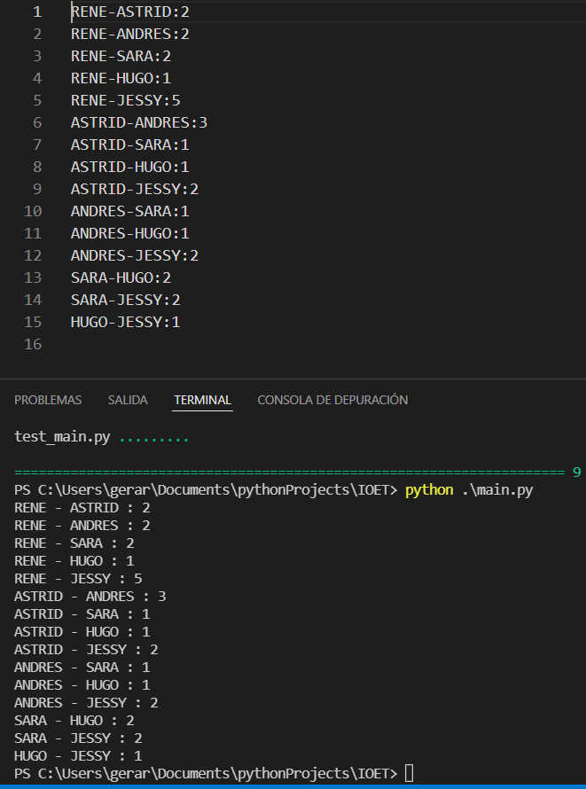

# IOET-EXERCISE
Solved exercise for application in IOET

# Exercise: 
The company ACME offers their employees the flexibility to work the hours they want. But due to some external circumstances they need to know what employees have been at the office within the same time frame

The goal of this exercise is to output a table containing pairs of employees and how often they have coincided in the office.

Input: the name of an employee and the schedule they worked, indicating the time and hours. This should be a .txt file with at least five sets of data. You can include the data from our examples below:

### Example 1:

#### INPUT
```
RENE=MO10:00-12:00,TU10:00-12:00,TH01:00-03:00,SA14:00-18:00,SU20:00-21:00
ASTRID=MO10:00-12:00,TH12:00-14:00,SU20:00-21:00
ANDRES=MO10:00-12:00,TH12:00-14:00,SU20:00-21:00
```

#### OUTPUT:
```
ASTRID-RENE: 2
ASTRID-ANDRES: 3
RENE-ANDRES: 2
```

### Example 2:

#### INPUT:
```
RENE=MO10:15-12:00,TU10:00-12:00,TH13:00-13:15,SA14:00-18:00,SU20:00-21:00
ASTRID=MO10:00-12:00,TH12:00-14:00,SU20:00-21:00
```

#### OUTPUT:
```
RENE-ASTRID: 3
```

# Solution:

The solution was implemented developed in Python 3.10.2 under a structured design architecture in a single class (main.py) in which the problem is divided into different functions that intervene to obtain the required result. In summary, the program solves the problem as follows:
* The txt file with the data to be processed is read.
* A matrix of employees with their corresponding schedule is created.
* The possible employee combinations are created from the employee matrix.
* The employee schedules for each combination are compared.
* Finally, the information is displayed in the console and stored in a txt file (results.txt).

# Instructions to run the project locally

##### Run the requirements.txt with the following command:

```
pip install -r requirements.txt
```

##### Run the following command in your working directory.

```
python main.py
```

#### Input
```
RENE=MO10:00-12:00,TU10:00-12:00,TH01:00-03:00,SA14:00-18:00,SU20:00-21:00
ASTRID=MO10:00-12:00,TH12:00-14:00,SU20:00-21:00
ANDRES=MO10:00-12:00,TH12:00-14:00,SU20:00-21:00
SARA=MO11:00-13:00,TU12:00-14:00,SA20:00-21:00
HUGO=MO12:00-13:00,FR12:00-14:00,SA20:15-21:00
JESSY=MO10:00-12:00,TU10:00-12:00,TH01:00-03:00,SA14:00-18:00,SU20:00-21:00
```

#### Expected Output
```
RENE-ASTRID:2
RENE-ANDRES:2
RENE-SARA:2
RENE-HUGO:1
RENE-JESSY:5
ASTRID-ANDRES:3
ASTRID-SARA:1
ASTRID-HUGO:1
ASTRID-JESSY:2
ANDRES-SARA:1
ANDRES-HUGO:1
ANDRES-JESSY:2
SARA-HUGO:2
SARA-JESSY:2
HUGO-JESSY:1
```



# Tests execution

#### Run the following command in your working directory.

```
pytest -v
```
#### Expected Output
```
==================================================================== test session starts =====================================================================
platform win32 -- Python 3.10.2, pytest-7.0.1, pluggy-1.0.0 -- C:\Users\gerar\AppData\Local\Programs\Python\Python310\python.exe
cachedir: .pytest_cache
rootdir: C:\Users\gerar\Documents\pythonProjects\IOET
plugins: mock-3.7.0
collected 9 items

test_main.py::test_compare_schedules[input_a0-input_b0-3] PASSED                                                                                        [ 11%] 
test_main.py::test_compare_schedules[input_a1-input_b1-3] PASSED                                                                                        [ 22%] 
test_main.py::test_compare_schedules[input_a2-input_b2-4] PASSED                                                                                        [ 33%] 
test_main.py::test_is_encounter[input_a0-input_b0-input_c0-input_d0-True] PASSED                                                                        [ 44%]
test_main.py::test_is_encounter[input_a1-input_b1-input_c1-input_d1-False] PASSED                                                                       [ 55%] 
test_main.py::test_is_encounter[input_a2-input_b2-input_c2-input_d2-True] PASSED                                                                        [ 66%] 
test_main.py::test_is_encounter[input_a3-input_b3-input_c3-input_d3-False] PASSED                                                                       [ 77%] 
test_main.py::test_get_employes PASSED                                                                                                                  [ 88%] 
test_main.py::test_write PASSED                                                                                                                         [100%]

===================================================================== 9 passed in 0.07s ======================================================================
```

